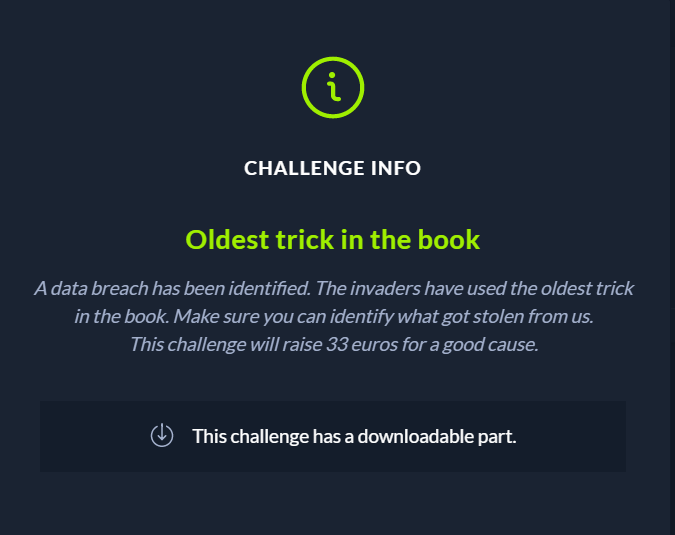
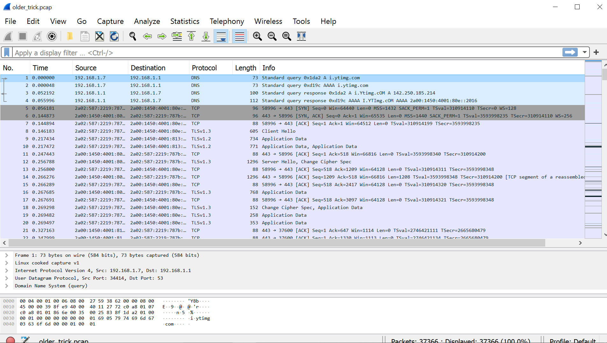
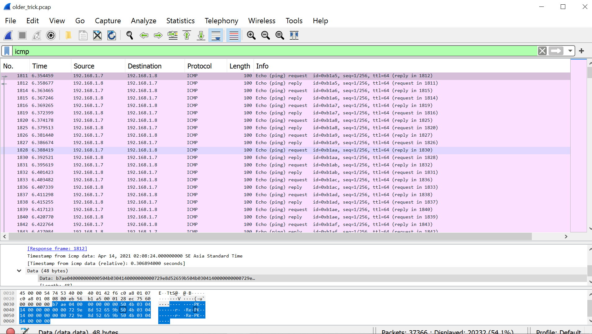
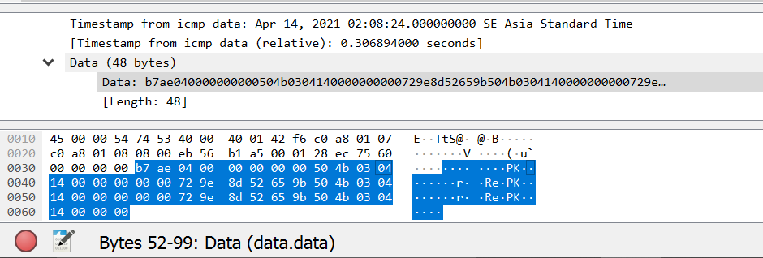

# Oldest trick in the book

<figure><figcaption></figcaption></figure>



Challenge này cho mình một file `PCAP`

<figure><figcaption></figcaption></figure>

`C`húng ta có các protocol như TCP, DNS, ICMP. Sau khi xem sơ lược thì ICMP là protocol ta cần chú ý đến, Filter `icmp` trên wireshark để lọc những thứ không cần thiết

<figure><figcaption></figcaption></figure>

* Tất cả các Protocol ICMP đều có length 100. Look at data, chúng ta có `PK` - file zip và chúng repeat 3 lần `PK`
* Sử dụng `tshark` để lấy payloads, dùng filter để lấy các packet reply `ip.dst == 192.168.1.`

```
tshark -r older_trick.pcap -Y "ip.dst == 192.168.1.8" -T fields -e data.data > raw
```

* Vậy chúng ta đã có được payload, nhưng vấn đề ở đây là làm sao để lấy file zip vì playload ở đây có tận 3 PK, vì vậy mình đã viết một đoạn python để lấy bytes từ vị trí 16 đến 48
*

<figure><figcaption></figcaption></figure>

```python
#!usr/bin/env python3
flag = []

with open('raw', 'r') as file:
	text = file.readlines()

for payload in text:
	flag.append(bytearray.fromhex(payload[16:48]))

with open('flag.zip', 'wb') as out_file:
	out_file.write(b''.join(flag))
```


```markup
┌──(kali㉿kali)-[~/Desktop/older]
└─$ unzip flag.zip 
Archive:  flag.zip
extracting: fini/addons.json        
 inflating: fini/addonStartup.json.lz4  
 inflating: fini/broadcast-listeners.json  
 inflating: fini/cert9.db           
 inflating: fini/compatibility.ini  
 inflating: fini/containers.json    
 inflating: fini/content-prefs.sqlite  
 inflating: fini/cookies.sqlite     
 inflating: fini/cookies.sqlite-shm  
 inflating: fini/cookies.sqlite-wal  
 inflating: fini/extension-preferences.json  
 inflating: fini/extensions.json    
 inflating: fini/favicons.sqlite    
 inflating: fini/favicons.sqlite-shm  
 inflating: fini/favicons.sqlite-wal  
 inflating: fini/formhistory.sqlite  
 inflating: fini/handlers.json      
 inflating: fini/key4.db            
 inflating: fini/logins.json        
 inflating: fini/permissions.sqlite  
 inflating: fini/pkcs11.txt         
 inflating: fini/places.sqlite      
 inflating: fini/places.sqlite-shm  
 inflating: fini/places.sqlite-wal  
 inflating: fini/prefs.js           
 inflating: fini/protections.sqlite  
 inflating: fini/search.json.mozlz4  
 inflating: fini/sessionCheckpoints.json  
extracting: fini/shield-preference-experiments.json  
 inflating: fini/SiteSecurityServiceState.txt  
 inflating: fini/storage.sqlite     
 inflating: fini/times.json         
 inflating: fini/webappsstore.sqlite  
 inflating: fini/webappsstore.sqlite-shm  
 inflating: fini/webappsstore.sqlite-wal  
 inflating: fini/xulstore.json 
```


* We have: json, sqlite, cookies, db

```
┌──(kali㉿kali)-[~/Desktop/older]
└─$ cd fini      

┌──(kali㉿kali)-[~/Desktop/older/fini]
└─$ sudo apt-get install jq
Reading package lists... Done
Building dependency tree... Done
Reading state information... Done
jq is already the newest version (1.6-2.1).
0 upgraded, 0 newly installed, 0 to remove and 394 not upgraded.
                                                        
┌──(kali㉿kali)-[~/Desktop/older/fini]
└─$ jq -r -S '.logins[] | .hostname, .encryptedUsername, .encryptedPassword' logins.json | pwdecrypt -d . -p foobar
https://rabbitmq.makelarid.es
Decrypted: "Frank_B"
Decrypted: "CHTB{long_time_no_s33_icmp}"
```
